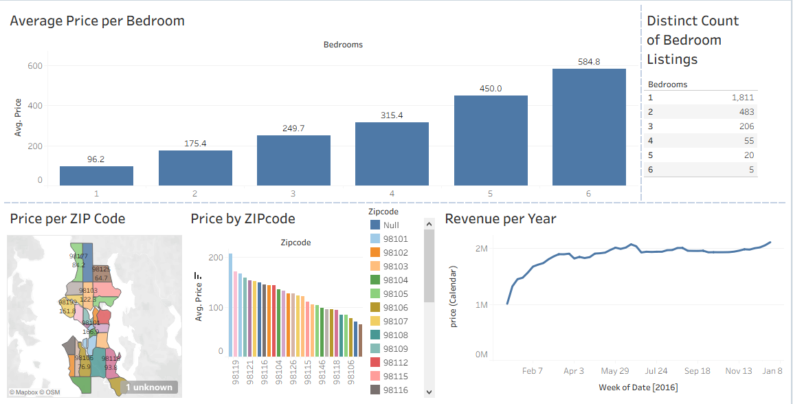

# Airbnb Price Analysis Dashboard (Tableau)

## Overview

This project analyzes Airbnb pricing trends based on bedroom count, ZIP code, and time.

## Dashboard Features

* Average price per bedroom
* Price distribution by ZIP code
* Geographic visualization (map)
* Revenue trends over time

## Tools Used

* Tableau Public
* Data visualization
* Data analysis

## Key Insights

* Prices increase significantly with bedroom count
* Certain ZIP codes have much higher average prices
* Revenue shows consistent growth over time
* Price grows almost linearly with bedroom count
  
## Files

* `.twbx` → full Tableau dashboard
* `/images` → dashboard preview
* `/data` → dataset used

## Preview

Live Dashboard: https://public.tableau.com/app/profile/murad.zhumabekov/viz/airbnb-tableau-dashboard/Dashboard1?publish=yes
